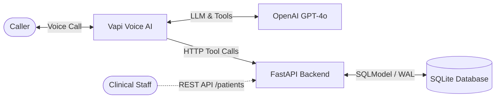
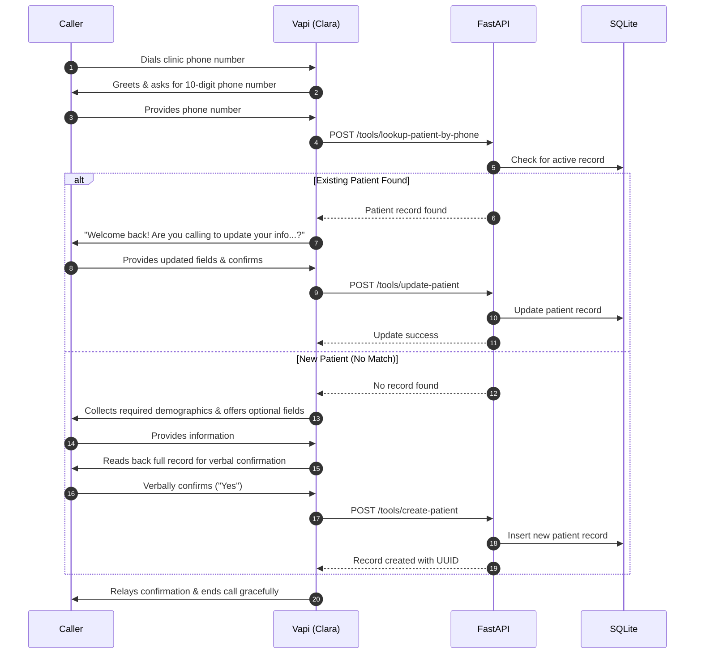

# Voice AI Agent — Patient Registration System

A voice-based patient intake and registration system designed for healthcare clinics. Callers can register as new patients or update existing medical records conversationally over the phone. The system combines telephony orchestration, real-time speech processing, and LLM reasoning (**Vapi**, **Deepgram**, **ElevenLabs**, and **OpenAI GPT-4o**) with a **FastAPI** backend service and persistent **SQLite** storage running in WAL mode.

---

## Overview

Patient intake over the phone is traditionally labor-intensive, error-prone, and frustrating for callers navigating rigid Interactive Voice Response (IVR) phone trees. This application replaces legacy DTMF phone trees with a warm, conversational AI intake coordinator named **Clara**.

### Core Capabilities
* **Inbound Phone Intake**: Dialable U.S. phone number powered by Vapi telephony.
* **Early Duplicate Detection**: Collects phone number first and checks for existing records before starting registration.
* **Returning Patient Updates**: Routes returning callers to an update workflow rather than duplicating records.
* **Flexible Ingestion**: Ingests multi-field answers volunteered in a single turn (e.g., name and DOB spoken together).
* **Targeted Reprompting**: Re-prompts *only* for invalid fields using natural conversational phrasing without exposing technical error jargon.
* **Verbal Confirmation Gate**: Reads back collected information as a coherent sentence and requires explicit verbal confirmation before persisting data.
* **Standardized REST API**: Exposes full CRUD endpoints wrapped in a uniform JSON envelope (`{"data": ..., "error": ...}`) for clinical dashboards and administrative QA.
* **Persistent Storage**: Data survives server restarts via a persistent SQLite database with Write-Ahead Logging (WAL) enabled.

---

## Key Features

* **Real Telephony & Low-Latency Voice Pipeline**: Inbound SIP/PSTN call handling via Vapi, real-time speech-to-text via Deepgram Nova-2, conversational reasoning via OpenAI GPT-4o, and text-to-speech via ElevenLabs.
* **Structured Function Calling**: Bidirectional tool integration between the voice agent and FastAPI backend supporting both direct tool endpoints (`/tools/*`) and universal Vapi webhook dispatch (`/api/vapi/webhook`).
* **Server-Side Validation**: Strict Pydantic v2 and SQLModel validation enforcing North American Numbering Plan (NANP) phone formats, valid non-future dates of birth (1900–present), 2-letter U.S. postal abbreviations, 5-digit / ZIP+4 codes, and ISO/US date strings.
* **Database Mutation Safeguard**: The LLM is strictly instructed never to invoke creation or update tools without explicit caller confirmation.
* **Clinical Audit Logging**: Full patient JSON payloads are logged to `stdout` upon creation, modification, and soft-deletion in compliance with the Twelve-Factor App methodology.
* **Soft-Delete Lifecycle**: Patient deletions set a UTC `deleted_at` timestamp, preserving historical records for clinical audits while immediately excluding them from active queries.
* **Automated Test Suite**: 10 automated unit and integration tests executing against an isolated in-memory SQLite database.

---

## System Architecture

The system consists of five distinct, known components communicating over standard protocols:



### Component Responsibilities

1. **Caller**: Interacts with the clinic intake system over a live telephone call.
2. **Vapi (Voice AI)**: Manages telephony connection, streaming speech-to-text, audio synthesis, and tool call dispatching.
3. **OpenAI GPT-4o (LLM)**: Governs conversational reasoning, extracts demographic fields from natural speech, and triggers tool calls.
4. **FastAPI Backend (`app/`)**: Receives tool webhooks (`/tools/*`, `/api/vapi/webhook`) and administrative REST requests (`/patients`, `/health`), enforcing server-side validation.
5. **SQLite Database (`patients.db`)**: Stores patient records with UUIDv4 identifiers, timestamps, and soft-delete markers, configured in Write-Ahead Logging (`PRAGMA journal_mode=WAL`) mode.

---

## How It Works: End-to-End Flow



### Flow Breakdown

1. **Call Connection & Greeting**: Caller dials into the clinic line. Clara answers and requests their 10-digit phone number.
2. **Early Duplicate Lookup**: Vapi calls `lookup_patient_by_phone`. The FastAPI backend checks SQLite for an existing, non-deleted patient with that phone number.
3. **Branch A — Returning Patient Update**: If a record exists, Clara greets the patient by name and asks if they wish to update their records. If updating, she collects the updated fields, confirms the change, and calls `update_patient`.
4. **Branch B — New Patient Registration**: If no record exists, Clara collects required demographics, offers optional fields in a single pass, and reads back the full record as a natural sentence for verbal verification.
5. **Database Mutation & Confirmation**: Only after receiving an explicit verbal affirmative confirmation ("yes") does Clara call `create_patient`. The API validates the fields, writes to SQLite, and Clara confirms registration to the caller.

---

## Technology Stack

| Layer | Technology | Version / Spec | Engineering Rationale |
| :--- | :--- | :--- | :--- |
| **Backend Framework** | **FastAPI** | `>=0.141.1` | Native async request handling, high throughput, automatic OpenAPI documentation, and dependency injection. |
| **ASGI Server** | **Uvicorn** | `>=0.52.4` | Production-ready ASGI server supporting standard loop policies and container process supervision. |
| **Data Modeling & ORM** | **SQLModel** | `>=0.0.42` | Combines SQLAlchemy ORM with Pydantic v2, eliminating schema duplication between database models and API contracts. |
| **Data Validation** | **Pydantic** | `>=2.13.5` | Fast C-based validation engine for strict runtime type enforcement, regex validation, and normalization. |
| **Database** | **SQLite (WAL Mode)** | `3.x` | Zero-latency local storage configured with Write-Ahead Logging (`PRAGMA journal_mode=WAL`) and `PRAGMA synchronous=NORMAL` for concurrent reads and writes without file locks. Persisted via volume mount in production. |
| **Voice Platform** | **Vapi** | Webhook API | Complete telephony orchestrator managing WebRTC/SIP, low-latency audio streaming, turn-taking, silence detection, and LLM tool execution. |
| **Speech-to-Text** | **Deepgram Nova-2** | `en-US` | Industry-leading transcription speed and accuracy with domain-specific keyword prompting for clinical terms. |
| **Text-to-Speech** | **ElevenLabs** | Voice ID `21m00Tcm4TlvDq8ikWAM` | Warm, human-sounding synthesis with tunable stability and similarity boost. |
| **LLM Reasoning** | **OpenAI GPT-4o** | Temperature `0.2` | High adherence to system prompts, precise JSON schema extraction, and deterministic tool invocation. |
| **Testing** | **pytest** + **httpx** | `>=9.1.1` / `>=0.28.1` | Automated test suite using `TestClient` and in-memory SQLite isolation. |
| **Containerization** | **Docker** | `python:3.12-slim` | Minimal single-stage container image. |
| **Cloud Deployment** | **Railway** | Persistent Volume Mount | Docker-based deployment with persistent volume mounted at `/app/data` to retain SQLite databases across deployments. |

---

## Project Structure

```text
voice-patient-registration-agent/
├── app/
│   ├── __init__.py           # Package exports (app, settings, models, database session)
│   ├── config.py             # Pydantic BaseSettings loading environment variables from .env
│   ├── database.py           # SQLite engine, WAL pragma setup, session dependency, auto-seeding
│   ├── main.py               # FastAPI application factory, CORS, global envelope exception handlers, CLI entrypoint
│   ├── models.py             # SQLModel Patient entity, SexEnum, and Pydantic validation functions
│   ├── schemas.py            # Generic ResponseEnvelope[T], HealthData, SoftDeleteData schemas
│   └── routers/
│       ├── __init__.py       # Router exports (health_router, patients_router, tools_router)
│       ├── health.py         # GET /health container monitoring probe
│       ├── patients.py       # REST API CRUD endpoints (/patients) with query filtering and stdout logging
│       └── tools.py          # Voice tool endpoints (/tools/*) and universal Vapi webhook dispatcher (/api/vapi/webhook)
├── data/                     # Local directory for SQLite database storage (patients.db)
├── scripts/
│   └── update_vapi.py        # Automation script to sync tool schemas and webhook URLs to Vapi Assistant
├── tests/
│   ├── __init__.py
│   └── test_api.py           # Comprehensive pytest suite (10 automated tests using in-memory SQLite)
├── .dockerignore             # Excludes venv, git, bytecode, and local database from image build
├── .env.example              # Template documenting all required and optional environment variables
├── .gitignore                # Git ignore patterns for Python caches, SQLite data, and virtual environments
├── Dockerfile                # Production Docker container build definition
├── main.py                   # Root launcher for 'python main.py' or 'uvicorn main:app'
├── pyproject.toml            # UV / PEP 621 package metadata and pytest configuration
├── railway.json              # Railway deployment configuration with health check path
├── requirements.txt          # Python dependency specifications
├── vapi_config.md            # Complete Vapi Assistant configuration, system instruction, and tool schemas
└── README.md                 # Production system documentation and technical evaluation guide
```

---

## Voice Agent

The voice agent is named **Clara**, a warm, efficient Patient Intake Coordinator at Metro Health Clinic.

### Voice Interaction Characteristics
* **Turn Style**: Natural, conversational dialogue (1–3 sentences per turn), never reciting a rigid script.
* **Micro-Acknowledgments**: Uses conversational markers ("Got it," "Perfect," "Thank you") to signal active listening.
* **First Message**:
  ```text
  Hi there! Thank you for calling Metro Health Clinic. My name is Clara, and I can help get you registered today. Could I start with your 10-digit phone number?
  ```
* **Early Phone Lookup**: Clara asks for the phone number upfront and immediately invokes `lookup_patient_by_phone`. If a match is found, Clara welcomes the patient back by name and asks if they wish to update their records.
* **Multi-Field Ingestion**: Callers can volunteer multiple pieces of information in a single turn (e.g., *"My name is David Martinez and my birthday is July 14th 1985"*). Clara extracts all provided fields simultaneously and moves directly to what remains missing.
* **Single-Pass Optional Offer**: Once all required fields are captured, Clara offers optional fields in a single conversational turn (*"We can also add insurance, an emergency contact, or a preferred language — want to add any of that, or skip to confirming?"*). A decline is accepted immediately without re-prompting.
* **Confirmation Gate**: Clara reads back the complete record as a single natural sentence (*"So that's Maria Alvarez, born March 3rd 1990, at 12 Oak Street, Austin, Texas, 78701 — did I get that right?"*).
* **Silent In-Line Corrections**: If the caller provides a correction, Clara updates the internal state silently, confirms *only* the corrected value, and asks if anything else needs adjusting. She does not re-read the entire record.
* **Tool Execution Guardrail**: Clara is strictly instructed to call `create_patient` or `update_patient` **only** after receiving an explicit verbal affirmative confirmation (*"yes"*, *"that's correct"*).
* **Graceful Failure Protocol**: If a tool call fails or the API is unreachable, Clara states:
  > *"I'm having a bit of trouble saving this on my end — no worries, I've got everything you told me, and our team will follow up at {phone_number} to finish this up. Thanks for your patience!"*

The complete system prompt, Assistant JSON payload, and prompt-engineering rationale are documented in [`vapi_config.md`](vapi_config.md).

---

## Tools / Function Calling

The voice agent interacts with the backend through three structured functions. The backend accepts both direct invocation on dedicated endpoints and routed invocation via the universal Vapi webhook endpoint.

| Tool Name | Endpoint | Trigger Condition | Parameters | Response Payload |
| :--- | :--- | :--- | :--- | :--- |
| `lookup_patient_by_phone` | `POST /tools/lookup-patient-by-phone` | Immediately after caller provides phone number | `phone_number` (string) | `{"found": true, ...patient_data}` or `{"found": false, "message": "..."}` |
| `create_patient` | `POST /tools/create-patient` | Only after read-back verification and caller's verbal "yes" | Required: `first_name`, `last_name`, `date_of_birth`, `sex`, `phone_number`, `address_line_1`, `city`, `state`, `zip_code`. Optional: `email`, `address_line_2`, `insurance_provider`, `insurance_member_id`, `preferred_language`, `emergency_contact_name`, `emergency_contact_phone` | `{"success": true, "patient_id": "...", "first_name": "...", "last_name": "...", ...}` |
| `update_patient` | `POST /tools/update-patient` | After existing caller confirms updates to their record | `patient_id` (string, UUID) + any updated demographic fields | `{"success": true, "patient_id": "...", "message": "..."}` |

### Route Aliases & Universal Webhook
To ensure compatibility across varying Vapi dashboard configurations, the backend provides:
* **Direct Kebab-Case & Snake-Case Routes**: Both `/tools/lookup-patient-by-phone` and `/tools/lookup_patient_by_phone` (with or without trailing slashes) are active.
* **Universal Webhook**: `POST /api/vapi/webhook` handles Vapi's Server URL webhook format (`{"message": {"type": "tool-calls", "toolCalls": [...]}}`) and formats responses in the required Vapi protocol: `{"results": [{"toolCallId": "...", "result": "..."}]}`.

---

## API Specification

All REST API endpoints conform to a standardized JSON response envelope:

**Success Response:**
```json
{
  "data": { ... },
  "error": null
}
```

**Error Response (Status 400, 404, 422, 500):**
```json
{
  "data": null,
  "error": "Descriptive error message"
}
```

### Endpoints

#### 1. Container Health Check
* **Method**: `GET`
* **Path**: `/health`
* **Status**: `200 OK`
* **Response Body**:
  ```json
  {
    "data": {
      "status": "healthy",
      "timestamp": "2026-09-04T02:00:00.000000+00:00"
    },
    "error": null
  }
  ```

#### 2. List Patients
* **Method**: `GET`
* **Path**: `/patients`
* **Query Parameters**:
  * `last_name` (optional string): Case-insensitive match on patient last name.
  * `date_of_birth` (optional string): Filter by date of birth (`YYYY-MM-DD` or `MM/DD/YYYY`).
  * `phone_number` (optional string): Filter by 10-digit U.S. phone number (formats normalized automatically).
* **Status**: `200 OK` (or `400 Bad Request` on invalid filter formatting)
* **Response Body**: Array of non-deleted patient records.

#### 3. Get Patient by ID
* **Method**: `GET`
* **Path**: `/patients/{id}`
* **Path Parameter**: `id` (UUID string)
* **Status**: `200 OK` / `400 Bad Request` (malformed UUID) / `404 Not Found` (non-existent or soft-deleted)
* **Response Body**: Single patient record envelope.

#### 4. Create Patient
* **Method**: `POST`
* **Path**: `/patients`
* **Status**: `201 Created` / `422 Unprocessable Content`
* **Request Body**:
  ```json
  {
    "first_name": "Jane",
    "last_name": "Doe",
    "date_of_birth": "1990-05-15",
    "sex": "Female",
    "phone_number": "4155551234",
    "email": "jane.doe@example.com",
    "address_line_1": "123 Market Street",
    "address_line_2": "Apt 4B",
    "city": "San Francisco",
    "state": "CA",
    "zip_code": "94105",
    "insurance_provider": "Blue Cross",
    "insurance_member_id": "BCBS-987654",
    "preferred_language": "English",
    "emergency_contact_name": "John Doe",
    "emergency_contact_phone": "4155559876"
  }
  ```
* **Side Effect**: Logs created patient payload JSON to `stdout`.

#### 5. Update Patient
* **Method**: `PUT`
* **Path**: `/patients/{id}`
* **Status**: `200 OK` / `404 Not Found` / `422 Unprocessable Content`
* **Request Body**: Partial dictionary of demographic fields to update. Setting required fields to `null` is rejected with `422`.
* **Side Effect**: Updates `updated_at` timestamp and logs payload to `stdout`.

#### 6. Soft-Delete Patient
* **Method**: `DELETE`
* **Path**: `/patients/{id}`
* **Status**: `200 OK` / `404 Not Found`
* **Response Body**:
  ```json
  {
    "data": {
      "patient_id": "67a7fa31-c052-4462-bd32-5a41d636dbd9",
      "message": "Patient successfully soft-deleted",
      "deleted_at": "2026-09-04T02:05:00.000000+00:00"
    },
    "error": null
  }
  ```

---

## Database Architecture

The data layer uses **SQLModel** mapped to a persistent **SQLite** database.

### SQLite Concurrency Settings
Default SQLite locking can lead to `sqlite3.OperationalError: database is locked` during concurrent webhook executions. On connection initialization, the engine executes:
```sql
PRAGMA journal_mode=WAL;
PRAGMA synchronous=NORMAL;
```
This enables Write-Ahead Logging (WAL), allowing concurrent readers while a write is occurring.

### Database Schema: `patients`

| Column | Type | Constraints / Validation | Indexed | Description |
| :--- | :--- | :--- | :---: | :--- |
| `patient_id` | `UUID` | Primary Key, Auto-generated UUIDv4 | Yes | Unique patient identifier |
| `first_name` | `VARCHAR` | Required, 1–50 chars, `^[a-zA-Z' -]{1,50}$` | Yes | Legal first name |
| `last_name` | `VARCHAR` | Required, 1–50 chars, `^[a-zA-Z' -]{1,50}$` | Yes | Legal last name |
| `date_of_birth` | `DATE` | Required, $1900 \le \text{DOB} \le \text{Today}$ | Yes | Birth date |
| `sex` | `VARCHAR` | Enum: `Male`, `Female`, `Other`, `Decline to Answer` | No | Administrative sex |
| `phone_number` | `VARCHAR` | Required, 10-digit normalized NANP string | Yes | Contact phone number |
| `email` | `VARCHAR` | Optional, validated email format | No | Email address |
| `address_line_1` | `VARCHAR` | Required, non-empty | No | Street address |
| `address_line_2` | `VARCHAR` | Optional | No | Apt / Suite / Unit |
| `city` | `VARCHAR` | Required, 1–100 characters | No | City |
| `state` | `VARCHAR(2)` | Required, 2-letter U.S. postal abbreviation | No | State code |
| `zip_code` | `VARCHAR` | Required, 5-digit (`^\d{5}$`) or ZIP+4 (`^\d{5}-\d{4}$`) | No | Postal code |
| `insurance_provider` | `VARCHAR` | Optional | No | Insurance carrier name |
| `insurance_member_id`| `VARCHAR` | Optional, alphanumeric + hyphens | No | Member / subscriber ID |
| `preferred_language` | `VARCHAR` | Optional, defaults to `"English"` | No | Spoken language |
| `emergency_contact_name` | `VARCHAR` | Optional | No | Contact person |
| `emergency_contact_phone`| `VARCHAR` | Optional, 10-digit normalized NANP string | No | Contact phone number |
| `created_at` | `DATETIME` | Default UTC now | No | Record creation timestamp |
| `updated_at` | `DATETIME` | Default UTC now, updated on mutation | No | Last update timestamp |
| `deleted_at` | `DATETIME` | Nullable, set on soft-deletion | Yes | Soft-delete marker |

### Seed Data
When the database is first initialized, the application automatically seeds two baseline records if the `patients` table is empty:
1. **Jane Doe** (`phone_number`: `4155551234`, `dob`: `1985-04-12`, San Francisco, CA)
2. **Robert Smith-Jones** (`phone_number`: `2125557890`, `dob`: `1972-11-23`, New York, NY)

---

## Configuration & Environment Variables

All settings are managed via Pydantic `BaseSettings` (`app/config.py`), reading from the environment or a `.env` file.

| Variable | Required | Default Value | Description |
| :--- | :---: | :--- | :--- |
| `DATABASE_URL` | No | `sqlite:///data/patients.db` | SQLAlchemy connection string. Set to `sqlite:////app/data/patients.db` when running with a persistent volume. |
| `PORT` | No | `8000` | HTTP port for the ASGI server. Provided automatically by Railway. |
| `HOST` | No | `0.0.0.0` | Bind host IP address. |
| `LOG_LEVEL` | No | `INFO` | Logging level (`DEBUG`, `INFO`, `WARNING`, `ERROR`). |
| `RAILWAY_URL` | No | `None` | Public domain of the deployed service (used by `scripts/update_vapi.py`). |
| `VAPI_API_KEY` | No | `None` | Vapi private API key (required only for running `scripts/update_vapi.py`). |
| `VAPI_ASSISTANT_ID` | No | `None` | Vapi Assistant UUID (required only for running `scripts/update_vapi.py`). |
| `VAPI_PHONE_NUMBER` | No | `None` | Dialable U.S. telephone number linked to the Vapi assistant. |
| `OPENAI_API_KEY` | No | `None` | OpenAI API key (configured in Vapi Dashboard for LLM completions). |

---

## Local Development

### Prerequisites
* Python 3.11+ (Python 3.12 or 3.13 recommended)
* `uv` (recommended) or standard `pip` + `python3 -m venv`

### 1. Clone & Setup
```bash
git clone https://github.com/your-username/voice-patient-registration-agent.git
cd voice-patient-registration-agent
```

### 2. Environment Configuration
```bash
cp .env.example .env
```
The default `.env` will store the SQLite database locally at `./data/patients.db`.

### 3. Install Dependencies

**Using `uv` (recommended):**
```bash
uv sync
```

**Using standard `pip`:**
```bash
python3 -m venv .venv
source .venv/bin/activate
pip install -r requirements.txt
```

### 4. Start Development Server

**Using `uv`:**
```bash
uv run uvicorn app.main:app --reload --port 8000
```

**Using activated virtual environment:**
```bash
uvicorn app.main:app --reload --port 8000
```

On startup, database tables are created automatically and seeded with the two sample patients.

* **Interactive API Documentation (Swagger)**: `http://localhost:8000/docs`
* **Alternative API Documentation (ReDoc)**: `http://localhost:8000/redoc`

---

## Docker

The project includes a production `Dockerfile` based on `python:3.12-slim`:

```dockerfile
FROM python:3.12-slim
WORKDIR /app
ENV PYTHONUNBUFFERED=1
COPY requirements.txt .
RUN pip install --no-cache-dir -r requirements.txt
COPY . .
EXPOSE 8000
CMD ["sh", "-c", "uvicorn app.main:app --host 0.0.0.0 --port ${PORT:-8000}"]
```

### Build & Run Locally with Docker
```bash
# Build the Docker image
docker build -t voice-patient-registration-agent .

# Run container with local directory mounted for persistent SQLite storage
docker run -d \
  -p 8000:8000 \
  -v $(pwd)/data:/app/data \
  -e DATABASE_URL="sqlite:////app/data/patients.db" \
  --name patient-agent \
  voice-patient-registration-agent
```

---

## Deployment to Railway (with Persistent Volume)

Railway provides frictionless deployment with zero cold starts and support for attached persistent disk volumes.

### Step 1: Deploy Service via Dashboard or CLI
1. Push code to GitHub.
2. In [Railway](https://railway.app), click **New Project** $\rightarrow$ **Deploy from GitHub repo**.
3. Railway automatically detects the `Dockerfile` and `railway.json`.

### Step 2: Attach Persistent Volume for SQLite
1. In the Railway project dashboard, select your service.
2. Navigate to **Volumes** $\rightarrow$ Click **Add Volume**.
3. Set the **Mount Path** to:
   ```text
   /app/data
   ```

### Step 3: Set Environment Variables
Under the **Variables** tab, set:
```text
DATABASE_URL=sqlite:////app/data/patients.db
LOG_LEVEL=INFO
```

### Step 4: Generate Public Domain
Under **Networking**, click **Generate Domain** (e.g., `https://voice-patient-agent-production.up.railway.app`).

### Step 5: Link Tools in Vapi Dashboard
Run the automated tool registration script locally or from CI:
```bash
export VAPI_API_KEY="your-vapi-key"
export VAPI_ASSISTANT_ID="your-assistant-id"
export RAILWAY_URL="https://your-service-production.up.railway.app"

uv run python scripts/update_vapi.py
```
This script registers the 3 tools into Vapi's Global Tools library and updates the assistant's Server URL to point to `/api/vapi/webhook/`.

---

## Verification & Testing

### Automated Test Suite
The repository includes 10 automated test cases in `tests/test_api.py`. The suite uses an in-memory SQLite database (`sqlite:///:memory:`) with `StaticPool` to ensure isolated execution without touching local disk files.

**Run Tests:**
```bash
# Using uv:
uv run pytest -v

# Using activated virtual environment:
pytest -v
```

**Test Coverage Summary:**
1. `test_health_check`: Probes `GET /health` and validates standard envelope structure.
2. `test_create_patient_success`: Validates `POST /patients` returns 201 Created with auto-generated UUIDv4.
3. `test_create_patient_validation_errors`: Validates `422 Unprocessable Content` on short phone number, future DOB, invalid state abbreviation, and missing required fields.
4. `test_list_patients_and_filters`: Validates filtering by `last_name`, `date_of_birth`, and formatted `phone_number`, as well as `400 Bad Request` handling on malformed query values.
5. `test_get_patient_by_id`: Verifies UUID lookups, 404 on missing records, and 400 on malformed UUID strings.
6. `test_update_patient_partial`: Tests partial updates and verifies that setting required fields to `null` is rejected with 422.
7. `test_soft_delete_patient`: Verifies `DELETE /patients/{id}` sets `deleted_at`, excludes the record from `GET /patients`, and returns 404 on subsequent queries.
8. `test_vapi_tools_lookup_patient`: Tests both direct REST calls and Vapi-formatted tool calls (`toolCallId`).
9. `test_vapi_tools_create_patient`: Tests voice agent patient registration and verifies database persistence.
10. `test_vapi_universal_webhook`: Verifies universal Vapi Server URL webhook routing (`POST /api/vapi/webhook`) and response formatting (`{"results": [...]}`).

### Manual Verification via cURL

**1. Health Probe:**
```bash
curl -s http://localhost:8000/health | jq .
```

**2. List Seed Patients:**
```bash
curl -s http://localhost:8000/patients | jq .
```

**3. Lookup Patient by Phone (Duplicate Check):**
```bash
curl -s -X POST http://localhost:8000/tools/lookup-patient-by-phone \
  -H "Content-Type: application/json" \
  -d '{"phone_number": "4155551234"}' | jq .
```

**4. Register New Patient:**
```bash
curl -s -X POST http://localhost:8000/patients \
  -H "Content-Type: application/json" \
  -d '{
    "first_name": "Carlos",
    "last_name": "Santana",
    "date_of_birth": "1975-07-20",
    "sex": "Male",
    "phone_number": "5125559876",
    "address_line_1": "789 Congress Ave",
    "city": "Austin",
    "state": "TX",
    "zip_code": "78701"
  }' | jq .
```

---

## Error Handling & Resilience

| Scenario | System Layer | Behavior & Recovery |
| :--- | :--- | :--- |
| **Invalid DOB (e.g. future date or year < 1900)** | Agent / Pydantic | Agent conversational re-prompt: *"That date's not quite landing for me — what year were you born?"* Server returns 422 with validation detail if called directly. |
| **Invalid Phone (not 10 digits or invalid area code)** | Agent / Pydantic | Agent conversational re-prompt: *"I want to get your number right — can you say that again?"* Server returns 422 detailing missing digits or invalid NANP area code. |
| **Invalid State Abbreviation** | Pydantic Validator | Maps state names or abbreviations to valid 2-letter postal codes. Rejects invalid codes with 422. |
| **Unclear Audio / Background Noise** | Agent Prompt | Clara states: *"Sorry, I didn't quite catch that — could you repeat it?"* Explicitly instructed never to guess or fabricate values. |
| **Caller Interrupts / Out-of-Order Answers** | Agent Prompt | Clara accepts any demographic fields volunteered in any order, tracks what has been collected, and asks only for what remains missing. |
| **Caller Wants to Start Over** | Agent Prompt | Clara confirms once (*"Sure — want me to clear what we've got and start fresh?"*), discards collected state, and restarts from the required demographic collection. |
| **Database or Tool Write Failure** | Agent Prompt / Tools Router | Exception is caught, logged to `stdout`, and returns `{"success": false}` to Vapi. Clara reassures the caller: *"I'm having a bit of trouble saving this on my end — no worries, I've got everything you told me, and our team will follow up..."* |
| **SQLite Concurrency Contention** | Database Layer | SQLite WAL mode (`PRAGMA journal_mode=WAL`) allows concurrent readers without blocking writes. |

---

## Security & Compliance Considerations

* **No Hardcoded Secrets**: All credentials (API keys, assistant IDs, database URLs) are loaded via environment variables and `.env`.
* **SQL Injection Prevention**: SQLModel ORM abstracts SQL generation using parameterized statements; no raw string SQL concatenation exists in the codebase.
* **Strict Server-Side Validation**: All data is validated independently on the backend. The API never relies solely on the LLM or voice platform for validation.
* **Audit Logging**: Created, updated, and soft-deleted patient payloads are output to structured `stdout` logs for auditing.
* **Take-Home Assessment Scope**:
  * The API endpoints currently run without OAuth2/JWT authentication to allow frictionless Vapi webhook access within the 3-hour constraint.
  * In a production healthcare deployment, endpoints would be secured with mutual TLS / webhook HMAC signature verification (`x-vapi-secret`), and the storage layer would require encryption-at-rest with customer-managed keys under a signed Business Associate Agreement (BAA) for HIPAA compliance.

---

## Design Decisions & Trade-offs

1. **Vapi vs. Self-Hosted Telephony (Twilio + Deepgram + Local TTS)**:
   * *Decision*: Used Vapi as the voice orchestration layer.
   * *Rationale*: Building a custom WebRTC/SIP pipeline, managing bi-directional audio websockets, handling interruptibility/barge-in, and synchronizing silence thresholds from scratch takes dozens of engineering hours. Vapi abstracts telephony and audio streaming reliably, allowing focus on prompt engineering, tool integration, validation, and data persistence.
2. **SQLite (WAL Mode) vs. PostgreSQL**:
   * *Decision*: Selected SQLite running in WAL mode with a persistent volume mount on Railway.
   * *Rationale*: Under a 3-hour implementation limit, SQLite eliminates database provisioning overhead and credential management while providing fast local and containerized performance. WAL mode prevents read/write lock contention. Persistent disk volume mounting ensures zero data loss across restarts and redeployments.
3. **SQLModel vs. Separate SQLAlchemy + Pydantic Layers**:
   * *Decision*: Unified models using SQLModel.
   * *Rationale*: Writing separate SQLAlchemy database models and Pydantic request/response schemas introduces duplicate field definitions and validation maintenance hazards. SQLModel unifies both into a single definition.
4. **Early Duplicate Interception**:
   * *Decision*: Clara asks for the phone number upfront and calls `lookup_patient_by_phone` before asking for names or addresses.
   * *Rationale*: Traditional intake forms collect all details before checking duplicates. Intercepting early saves caller time, prevents duplicate database records, and creates a personalized experience for returning patients.
5. **Confirmation Gate Before Tool Invocation**:
   * *Decision*: The LLM is prohibited from calling `create_patient` until the caller explicitly confirms the read-back.
   * *Rationale*: Voice conversations are non-linear; callers frequently correct misheard names or addresses. Gating database writes behind verbal confirmation prevents partial or inaccurate database records.

---

## Known Limitations

* **Write Concurrency**: SQLite with WAL mode supports concurrent readers and serialized writes. For high concurrent write volumes (e.g., hundreds of simultaneous active calls), the engine should be upgraded to PostgreSQL with connection pooling.
* **Unauthenticated Webhooks**: Webhook endpoints (`/tools/*` and `/api/vapi/webhook`) are unauthenticated. Production requires HMAC secret verification via custom headers.
* **Single-Agent Scope**: Clara manages both intake and updates within a single agent configuration. In large clinical networks, a supervisor router agent would triage inbound callers to specialized sub-agents (e.g., triage, billing, scheduling).
* **Phonetic Ambiguities**: Voice transcription may occasionally mishear complex surnames or street abbreviations. While the prompt supports spelling out characters, integrating phonetic tokenization (e.g., NATO phonetic spelling fallbacks) would improve capture rates.

---

## Future Improvements

1. **PostgreSQL Migration**: Migrate SQLite to PostgreSQL (`asyncpg`) using Alembic for database schema migrations.
2. **Webhook HMAC Authentication**: Validate Vapi's webhook signature header (`x-vapi-secret`) on all `/tools/*` and `/api/vapi/webhook` routes.
3. **Multilingual Support**: Add language detection in Vapi so Clara can switch dynamically to Spanish or Mandarin and persist the caller's `preferred_language`.
4. **Appointment Scheduling Integration**: Add a follow-up tool (`schedule_appointment`) offering open clinical calendar slots immediately following registration.
5. **Call Transcript & Recording Ingestion**: Ingest Vapi `end-of-call-report` webhooks to attach audio recording URLs and formatted clinical dialogue summaries directly to the patient's record.

---

## Assessment Coverage

| Evaluation Area (20% Each) | Implementation Evidence in Codebase |
| :--- | :--- |
| **1. Working System** | End-to-end phone flow functional; persistent SQLite database retains records across restarts; second call detects returning patients; 10 automated test cases pass (`uv run pytest`). |
| **2. Conversational Quality** | Clara persona in [`vapi_config.md`](vapi_config.md); natural phrasing (1–3 sentences); multi-field intake; targeted inline re-prompting; single-pass optional field offer; read-back confirmation gate; graceful failure messaging. |
| **3. Technical Architecture** | Clean separation of concerns (`telephony/voice` $\rightarrow$ `LLM` $\rightarrow$ `tools` $\rightarrow$ `FastAPI` $\rightarrow$ `SQLModel` $\rightarrow$ `SQLite`). Consistent envelope contract `{"data": ..., "error": ...}`, proper HTTP status codes (200, 201, 400, 404, 422, 500). |
| **4. Code Quality & Documentation** | Canonical FastAPI `app/` structure; centralized configuration via `app/config.py`; comprehensive `vapi_config.md`; complete `README.md` with exact setup commands and architecture diagrams. |
| **5. Edge Cases & Resilience** | Field validation (DOB, phone, state, ZIP); audio repetition handling; conversational restart capability; database write failure fallback messaging; SQLite WAL mode for concurrency. |
| **Bonus: Duplicate Detection** | `lookup_patient_by_phone` detects returning callers by phone and routes to `update_patient`. |
| **Bonus: Automated Tests** | 10 unit and integration tests covering the API, validation rules, query filters, soft-deletion, and Vapi webhooks in `tests/test_api.py`. |

---

## Example Usage

### Conversational Flow (New Registration)

```text
Clara:  "Hi there! Thank you for calling Metro Health Clinic. My name is Clara, and I can 
        help get you registered today. Could I start with your 10-digit phone number?"
Caller: "Sure, it's 512-555-4321."
[Tool Call: lookup_patient_by_phone(phone_number="5125554321") -> {"found": false}]

Clara:  "Thanks! Let's get you registered. Could you give me your legal first and last name, 
        and your date of birth?"
Caller: "My name is Samantha Cruz, and I was born March 10th, 1992."
Clara:  "Got it, Samantha. And what is your administrative sex — Male, Female, or Other?"
Caller: "Female."
Clara:  "Thank you. What is your home address, including city, state, and ZIP code?"
Caller: "456 Oak Avenue, Austin, Texas, 78704."
Clara:  "Got that. We can also add insurance, an emergency contact, or a preferred language — 
        want to add any of that, or skip to confirming?"
Caller: "No, that's everything."
Clara:  "So that's Samantha Cruz, born March 10th, 1992, Female, at 456 Oak Avenue, Austin, 
        Texas, 78704, with phone number 512-555-4321 — did I get that right?"
Caller: "Yes, that's correct."
[Tool Call: create_patient(...) -> {"success": true, "patient_id": "9b1deb4d-3b7d-4bad-9bdd-2b0d7b3dcb6d"}]

Clara:  "You're all set, Samantha — thanks for registering with Metro Health Clinic! Have a wonderful day!"
```

### Conversational Flow (Returning Patient Update)

```text
Clara:  "Hi there! Thank you for calling Metro Health Clinic. My name is Clara, and I can 
        help get you registered today. Could I start with your 10-digit phone number?"
Caller: "512-555-4321."
[Tool Call: lookup_patient_by_phone(phone_number="5125554321") -> {"found": true, "first_name": "Samantha", ...}]

Clara:  "Welcome back, Samantha! I see we already have an account on file for you. Are you 
        calling today to update your information, or is this for someone new?"
Caller: "I just moved and need to update my address."
Clara:  "I can certainly help with that! What is your new address?"
Caller: "1200 South Congress, Austin, Texas, 78704."
Clara:  "Got it — updated your address to 1200 South Congress, Austin, Texas, 78704. Did I get that right?"
Caller: "Yes."
[Tool Call: update_patient(patient_id="...", address_line_1="1200 South Congress", ...) -> {"success": true}]

Clara:  "Your address has been updated in our records, Samantha. Anything else I can help you with today?"
```

---

## Troubleshooting

| Issue | Cause | Resolution |
| :--- | :--- | :--- |
| **`sqlite3.OperationalError: unable to open database file`** | Missing parent directory for database path. | The application automatically creates parent directories via `_prepare_db_path()` with fallback to `./data/patients.db`. Ensure the process has write permissions to `./data` or `/app/data`. |
| **`sqlite3.OperationalError: database is locked`** | Concurrent writes on SQLite in standard journal mode. | WAL mode is enabled automatically on engine startup (`PRAGMA journal_mode=WAL`). Ensure SQLite is hosted on local or attached block storage, not network filesystems (NFS/SMB) that do not support POSIX file locking. |
| **Vapi Webhook Returns `404 Not Found`** | URL path mismatch or missing trailing slash. | The backend registers both kebab-case (`/tools/create-patient`) and snake-case (`/tools/create_patient`) endpoints with and without trailing slashes, and provides `/api/vapi/webhook` as a universal handler. Verify the URL configured in Vapi matches your deployment domain. |
| **`scripts/update_vapi.py` reports missing variables** | Missing credentials in `.env`. | Ensure `VAPI_API_KEY`, `VAPI_ASSISTANT_ID`, and `RAILWAY_URL` are defined in `.env` before running the script. |
| **Railway Container Health Check Fails** | Application taking longer than 30s to start or binding to incorrect port. | `railway.json` probes `/health`. Ensure `PORT` is bound dynamically via `CMD ["sh", "-c", "uvicorn app.main:app --host 0.0.0.0 --port ${PORT:-8000}"]`. |
